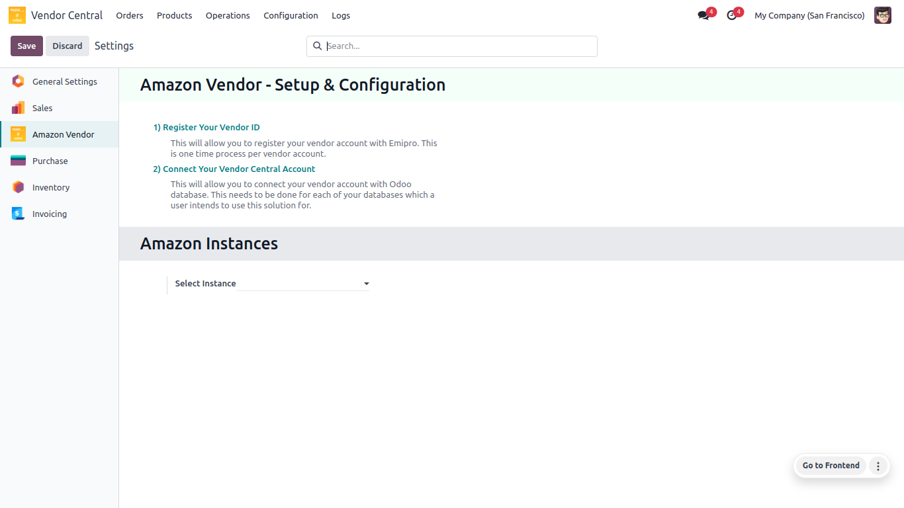

<h1 align="center"><strong> Amazon Vendor Setup and Configuration </strong></h1>

### This is the process of registering as an Amazon vendor, connecting to the Amazon vendor central account with your Vendor ID Token and setting up VAT number configuration.

* Go to **Vendor Central ↣ Configuration ↣ Settings**

 

  

 
