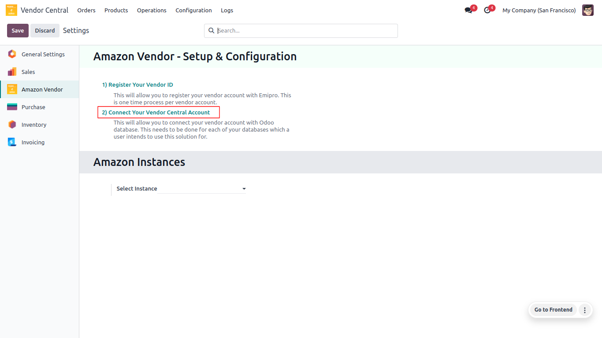
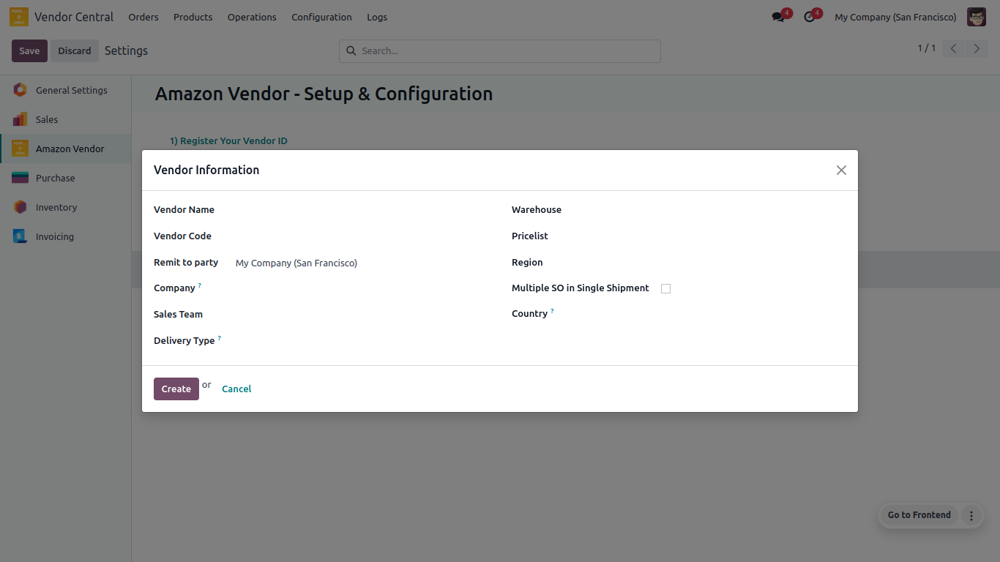

# <h1 align="center"> Connect Your Vendor Central Account </h1>

#### As per Amazon’s [Acceptable Use Policy](https://docs.developer.amazonservices.com/en_US/dev_guide/DG_AcceptableUsePolicy.html) and [Data Protection Policy](https://docs.developer.amazonservices.com/en_US/dev_guide/DG_DataProtectionPolicy.html), the seller has to authorize Emipro’s Seller Application in their Seller Central account.

* **Go to Vendor Central ↣ Configuration ↣ Settings**
* **Click on Connect Your Vendor Central Account**

 

 

#### A pop-up window will open and you need to fill in the required details here.

 

 

* **Vendor Name:** Enter the Name of Amazon Vendor. It can be anything depending on the user.

* **Warehouse:** The User needs to select your warehouse here.

 * **Vendor Code:** Enter the vendor code of Amazon Vendor.

* **Pricelist:** The User needs to select your pricelist here.

* **Remit To Party:** The User needs to select your remit party here.

* **Region:** The User needs to select your region here.

* **Company:** The user needs to select his/her company of seller. Make sure it is correct because all transactions will be carried out by Odoo on the basis of the configuration of the company.

* **Multiple SO in Single Shipment:** The User needs to check if your multiple sale order is sent in a single shipment here.

* **Sales Team:** The User needs to select your sales team here.

* **Country:** The User needs to select your country here.

* **Delivery Type:** The User needs to select your delivery type (We Pay or We Not Pay) here.

After filling in all the required details click on the **Create** button.

Good job, the User has successfully connected your vendor account to the ODOO Vendor Central.