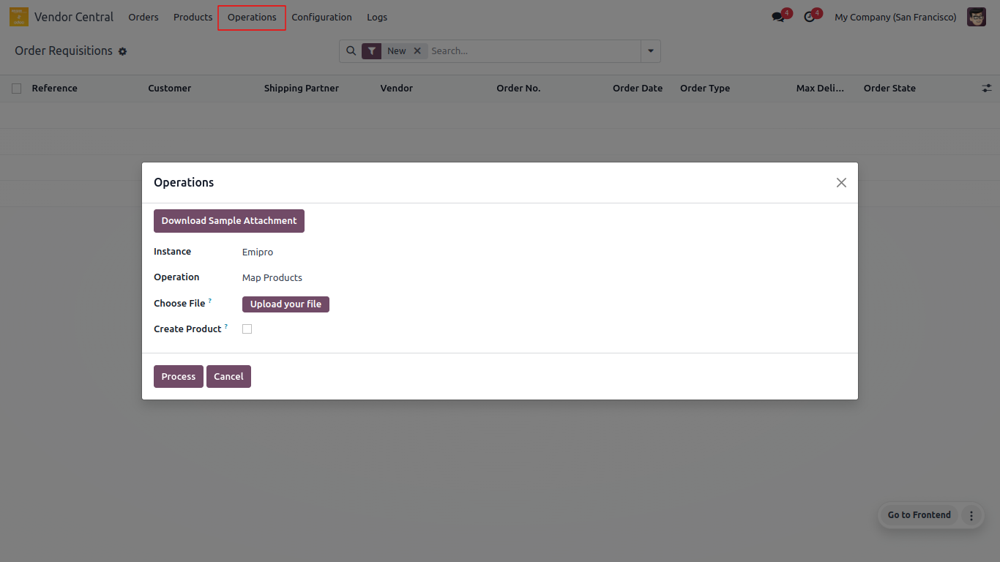

<h1 align="center"><strong>  Import / Map Products </strong></h1>

The connector doesn’t directly sync products between amazon & odoo, instead, it creates a layer above odoo products called amazon products. It will sync amazon products with existing odoo products and if the product is not found, then the system will create a product in odoo based on configuration.

<h3> Import / Map Products</h3>

* When products are available in Odoo with internal reference and same SKU on Amazon.
* When there is a product in Amazon, but not in Odoo, and you wish to create a product with the same internal reference as Amazon.

 

<h4> How To Process:</h4>

* Navigate to **Vendor Central ↣ Operations**
* Select Instance
* Select Operation for **Map Products**
* Choose File
* Click on **Process**

 

There is one check box.

* **Create Product?:** With the help of this feature system will auto create products if not found in Odoo. while synchronizing active products.

 

  

 

* The sync process will search for Vendor SKU or Vendor Barcode in Amazon products. If SKU or Barcode is found, it will update with the latest data received from the file.
* If the product is not found on Amazon, it will search in Odoo product in **Sales ↣ Products ↣ Product Variants.** It will then add the product to the amazon product in **Vendor Central ↣ Products ↣ Products** if SKU/Internal Reference are found in Odoo.
* In any case, if SKU/Internal Reference cannot be found in Odoo products, a skip line log will be created that can be checked from the Log Lines in **Vendor Central logs ↣ Log Lines.**