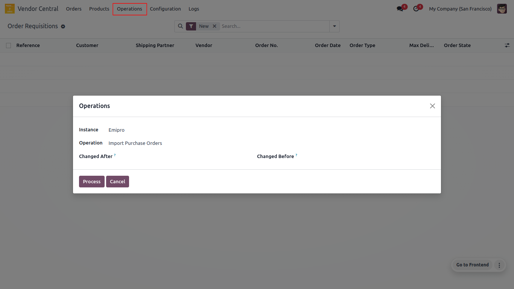
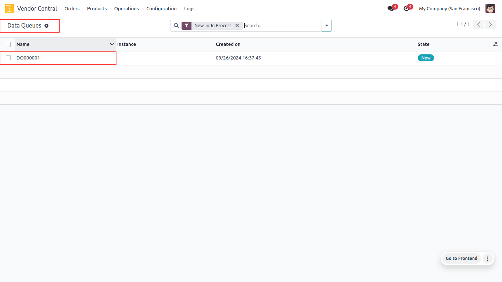
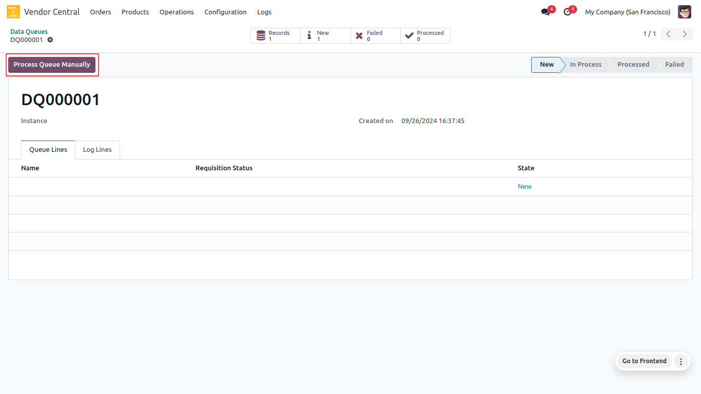
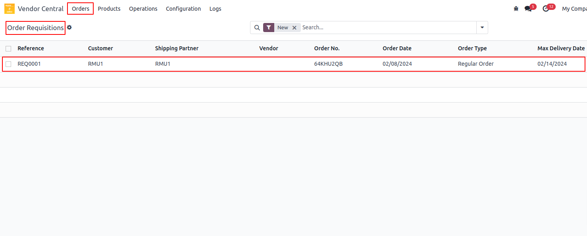
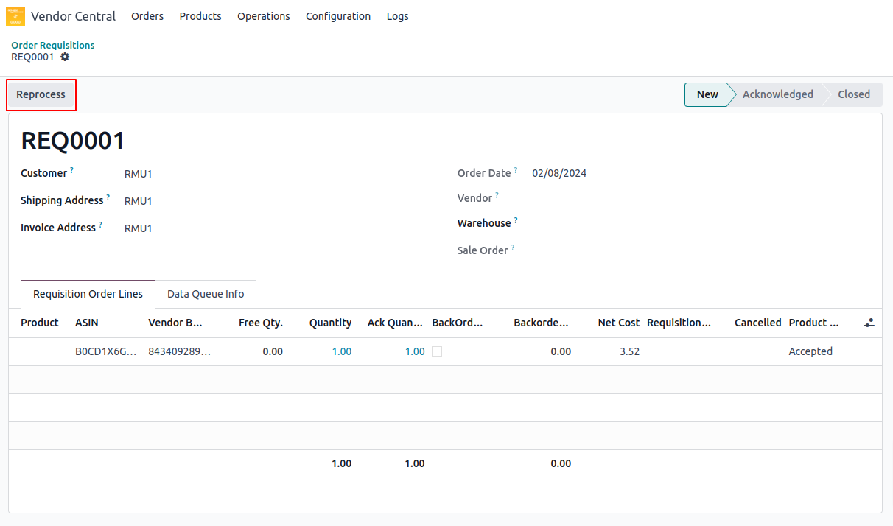
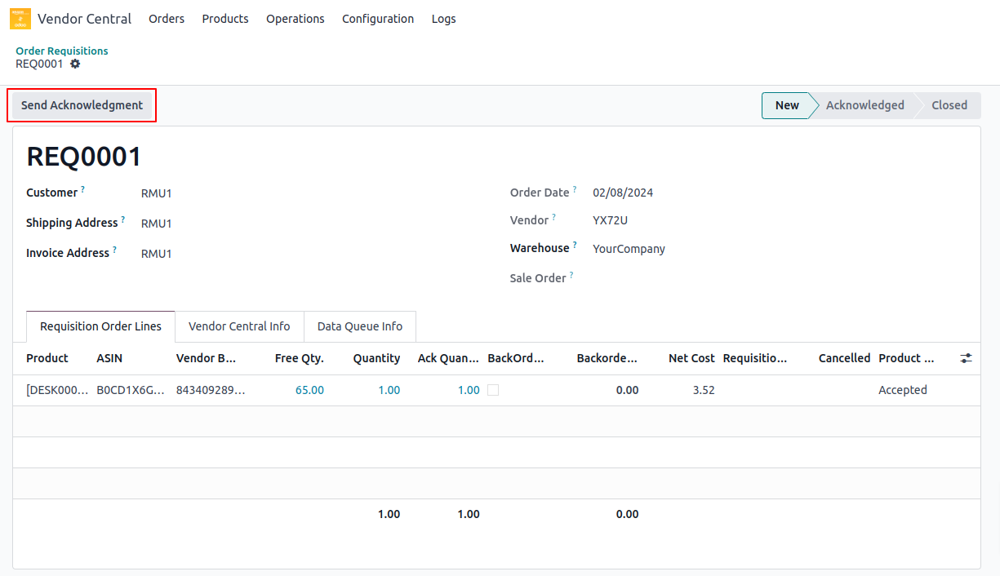
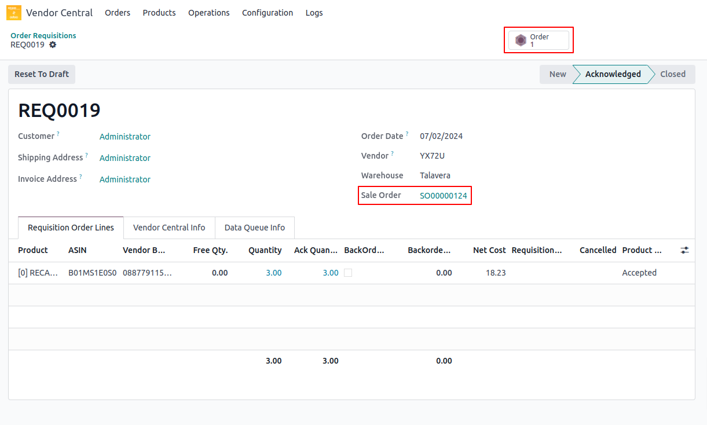

<h1 align="center"><strong>  Import Purchase Orders </strong></h1>

When we request import orders to Amazon , the system sends a request to the Amazon server for the new orders to be imported.

#### How To Process:

* Navigate to **Vendor Central ↣ Operations**
* Select Instance
* Select Operation for **Import Purchase Orders**
* Select **Changed After** Date
* Select **Changed Before** Date
* Click on **Process**

 

 

* As soon as you click on the Process button, you will see a new screen with the Data Queue.

 

 

* Open the record and click on the **Process Queue Manually** button.

 

 

* After clicking on the **Process Queue Manually** button, you will see a new screen with the **Order Requisition.**
* As a result of Amazon's data queue response, an Order Requisition was automatically created.
* As per Amazon's product mapping, the product is automatically set as part of this requisition line.

 

 

* There is a **Reprocess** button on the order requisition if no product is found. After mapping an Odoo product to an Amazon product, click on the **Reprocess** button.

 

 

* The order requisition includes a button for sending an acknowledgement. send an acknowledgement request to Amazon Vendor Central by clicking on the **Send Acknowledgement** button.

 

* After clicking on the **Send Acknowledgement** button, you will see a new screen with the **Sale Order.**
* Create the sale order in accordance with the requisition.
* Sale order **Reset to Draft** form requisition. 
* Not allowed from direct reset to draft the vendor central orders.

 

