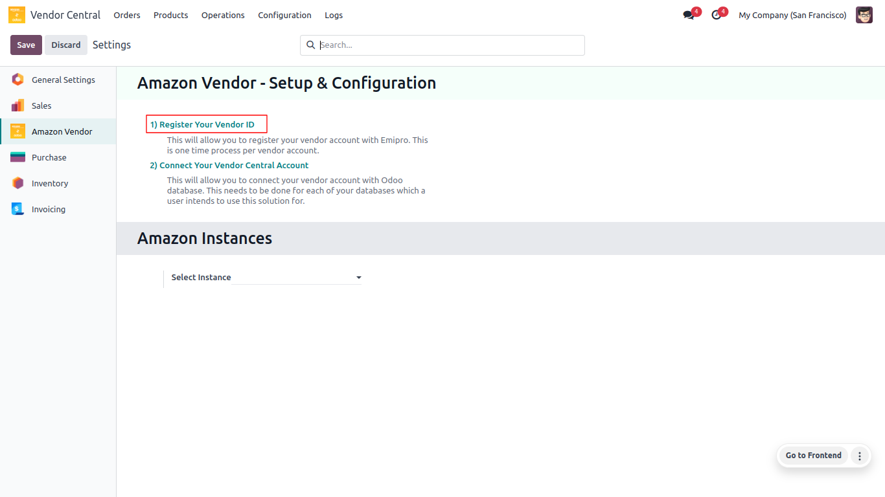
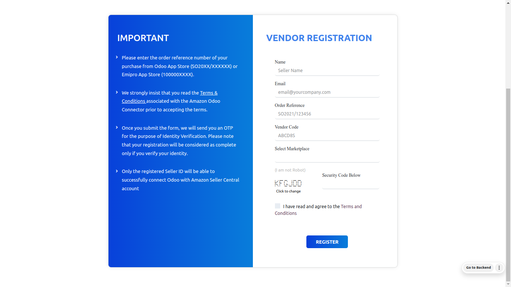

<h1 align="center"><strong>  Register Your Vendor ID </strong></h1>

<h3> As per Amazon’s <a href="https://docs.developer.amazonservices.com/en_US/dev_guide/DG_AcceptableUsePolicy.html">Acceptable Use Policy</a> and <a href="https://docs.developer.amazonservices.com/en_US/dev_guide/DG_DataProtectionPolicy.html">Data Protection Policy</a>, the seller has to authorize Emipro’s Seller Application in their Seller Central account. </h3>

 

* **Go to Vendor Central ↣ Configuration ↣ Settings**
* **Click on Register Your Vendor ID**

 

  

 

<h3> Vendor Registration Form</h3>

 

  

 

A registration form will open after you click on the **Register Your Seller ID** button. This form requires a few fields to be filled in.

* **Name:** The user needs to fill in the name of your business here.

* **Email:** The user needs to fill in his/her email ID **which is registered with your seller central account** as it needs to be verified later on.

 * **Order Reference:** The User needs to enter the purchase order reference for the Amazon odoo connector from the Odoo App Store here (Example: SO2022/XXXXXXX). The User will find it in the email he/she received regarding the purchase of Emipro's Amazon Odoo connector.

* **Merchant ID/Seller ID:** The User needs to fill in your Merchant ID/Seller ID here.

* **Select Marketplace:** The user needs to select the marketplace/s that the user has configured in your Seller Central.

