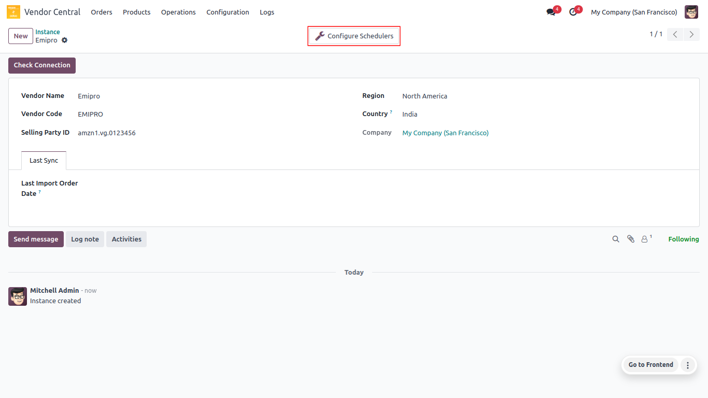
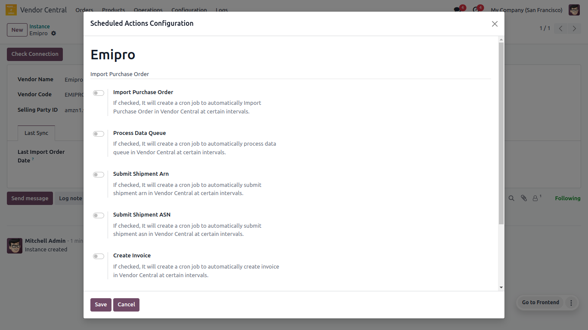

<h1 align="center"><strong>  Scheduler Configuration </strong></h1>

#### What is a scheduler and its usage ?

With the help of the scheduler, the operation will automatically be performed in accordance with the time intervals configured by the system.

* It can be hours, days or months.
* You can configure scheduler Vendor wise
* Navigate to **Vendor Central ↣ Configuration ↣ Instance**

 

  

 

You can set the following schedulers with the help of this connector to automate your transactions.

* Navigate to **Vendor Central ↣ Configuration ↣ Instance**
* Click on the Instance
* Click on the Configure Schedulers Button

 

  

 

#### Import Purchase Order
* This scheduler will import purchase orders from Vendor Central to Odoo.
* Import order as per time interval of the scheduler and get orders from vendor central as per instance selected Order Status.
* After running this scheduler set the last imported order date in instance. Because again run this scheduler and get order as per the last imported date.

#### Process Data Queue
* This scheduler will process  data queues and create requisitions on Odoo.
* Find data queue which is not in ‘processed’,’failed’ and process that queues and create requisitions.

#### Submit Shipment ARN
* This scheduler will submit shipment from Odoo to Vendor Central.

#### Submit Shipment ASN
* This scheduler will submit shipment confirmation from Odoo to Vendor Central.

#### Create Invoice
* This scheduler will create an invoice in Odoo which shipment submitted ASN.

#### Submit Invoice
* This scheduler will submit an invoice from Odoo to Vendor Central.

#### Get ARN
* This scheduler will import ARN from Vendor Central to Odoo shipment.
