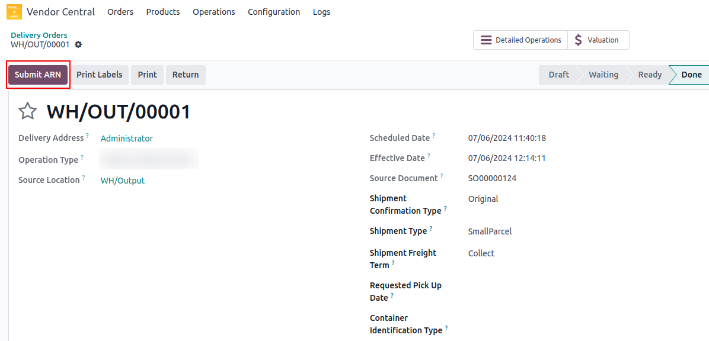

# <h1 align="center"> Submit ARN </h2>

The Submit ARN operation is designed for Collect or WePay vendors to submit requests for the pickup of their shipments by Amazon.

#### How To Process:

* Navigate to **Vendor Central ↣ Delivery Orders**
* Open **Your Delivery Order**
* Click on **Submit ARN**

 

 

> **Note** : When submitting a shipment request, the requested pickup date must be a minimum of two business days after the current date.

