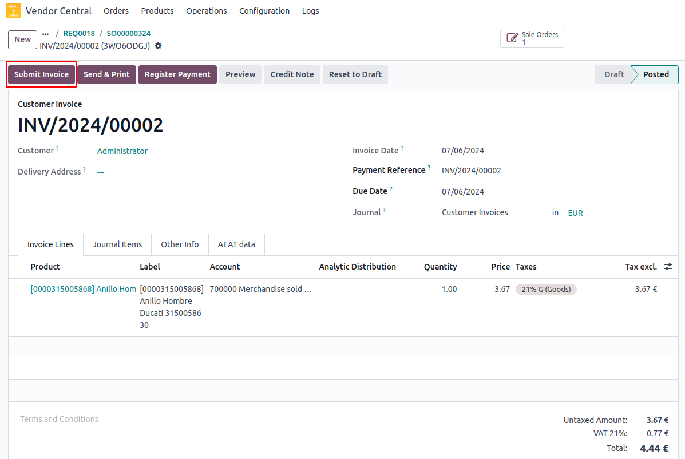

# <h1 align="center"> Submit Invoice </h1>

You can use the **Submit Invoice** operation to request payment from amazon for items shipped.

#### How To Process:

* Navigate to **Vendor Central ↣ Invoices**
* Open **Your Invoice**
* Click on **Submit Invoice**

 

 

