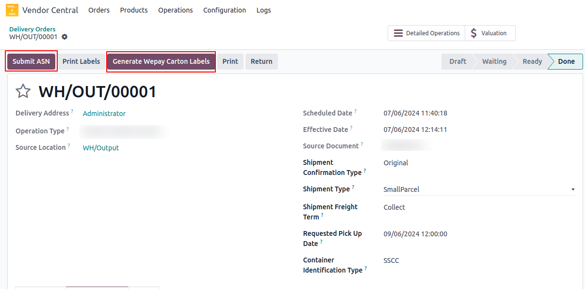

<h1 align="center"><strong>  Submit Shipment ASN </strong></h1>

You can use the **Submit ASN** operation to submit shipment confirmations to Amazon.

#### How To Process:

* Navigate to **Vendor Central ↣ Delivery Orders**
* Open **Your Delivery Order**
* Click on **Generate Wepay Carton Labels**
* Click on **Submit ASN**

 

  

 

> **Note** : When submitting a shipment confirmation request, the ARN , SSCC number on packages and other package details if package available must be set otherwise amazon will not accept.

